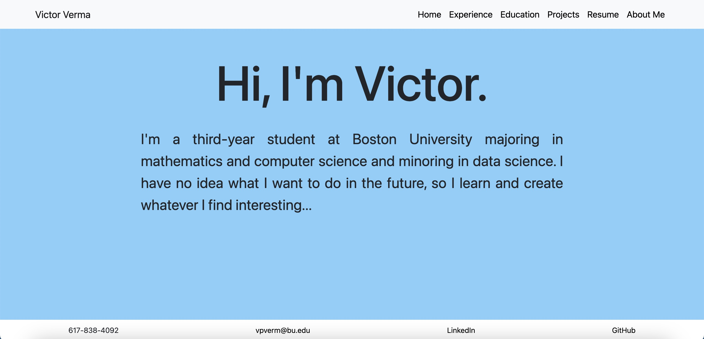

# Portfolio
I designed and created my own portfolio website using TypeScript, HTML, CSS, and Bootstrap in a Vite + React framework. I had some previous basic knowledge of HTML and CSS, but I learned everything else on my own for this project. The portfolio website is deployed on Vercel and periodically receives updates and improvements.

Live Demo: https://victor-verma-portfolio.vercel.app/

Homepage:

